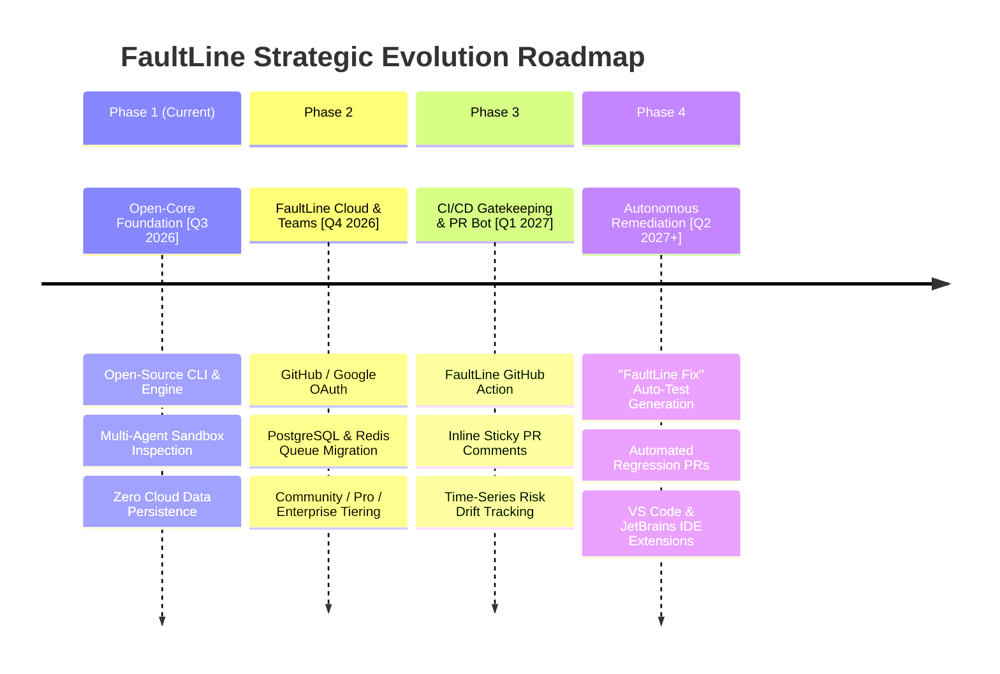

# FaultLine — Commercial Roadmap & Product Vision

This document outlines the strategic product roadmap and go-to-market commercialization strategy for **FaultLine**. FaultLine transitions from an open-source research engine to a developer-first SaaS platform using an **Open-Core** business model.

---

## 🧭 Strategic Roadmap Phases



---

### Phase 1: Open-Core Foundation (Current State) `[Q3 2026]`
*Focus: Developer trust, offline reproducibility, and deterministic ground-truth verification.*

- **Open-Source Local Engine & CLI**: Developers can run full multi-agent audits locally with zero cloud telemetry.
- **7 Domain-Specialized Agents**: AST analysis, test health inspection, git history churn, dependency CVE scanning, and documentation consistency.
- **Adversarial Sandbox Verification Filter**: Validates all agent findings against physical files and line numbers in ephemeral sandboxes.
- **Zero-Storage Privacy Model**: Sandboxes and analysis memory are ephemeral and discarded upon execution completion.

---

### Phase 2: FaultLine Cloud & Team Workspaces (Commercial MVP) `[Q4 2026]`
*Focus: Team collaboration, cloud multi-tenancy, and subscription infrastructure.*

- **Authentication & Multi-Tenancy**:
  - GitHub OAuth and Google Single Sign-On (SSO).
  - Organization and Team workspaces with granular Role-Based Access Control (RBAC: *Org Admin*, *Tech Lead*, *Developer*, *Viewer*).
- **Data Layer Migration**:
  - Migrate persistence layer from SQLite to managed **PostgreSQL** with Row-Level Security (RLS).
  - Integrate **Redis** and **Temporal / Celery** distributed task queues for parallel enterprise repo cloning and background analysis workers.
- **Commercial Tiering Structure**:

| Tier | Pricing | Target Audience | Key Features |
| :--- | :--- | :--- | :--- |
| **Community** | **Free / OSS** | Solo devs & open-source projects | Unlimited local CLI scans, up to 3 public cloud repos, core 7 analysis agents. |
| **Pro** | **$29 / dev / mo** | High-velocity startup dev teams | Unlimited private repos, automated webhook triggers on push, deeper AST traversal, priority sandboxes. |
| **Enterprise** | **Custom Annual** | Regulated industries & large engineering orgs | SAML/SSO, custom architectural compliance rules, on-prem/VPC sandbox runners, SOC2 Type II audit logs. |

---

### Phase 3: Active CI/CD Gatekeeping & PR Bot `[Q1 2027]`
*Focus: Shift-left pull request gatekeeping and longitudinal project health monitoring.*

- **FaultLine GitHub Action & GitLab CI Integration**:
  - Enforce branch protection rules: automatically block PR merges if new code introduces compounded critical hotspots or reduces test safety below team thresholds.
- **Automated Inline PR Comments**:
  - Sticky bot comments displaying verified failure proofs with clickable GitHub line references and reproduction traces.
- **Risk Drift & Longitudinal Telemetry**:
  - Time-series tracking of technical debt and risk drift over time across branches, releases, and quarters.
  - Team velocity vs. defect density heatmaps.

---

### Phase 4: Autonomous Remediation ("FaultLine Fix") `[Q2 2027+]`
*Focus: Autonomous code healing and real-time developer IDE guidance.*

- **Automated Regression Test Synthesis**:
  - The `VerificationAgent` doesn't just flag untested hotspots—it actively synthesizes targeted unit and integration tests (e.g. `pytest`, `jest`) to cover the exact branch conditions identified by `CodeRiskAgent`.
  - Automatically opens a ready-to-merge draft pull request titled `fix(tests): add regression coverage for payment_engine.py`.
- **IDE Extensions (VS Code & JetBrains)**:
  - Real-time pre-commit warnings directly in the editor gutter when cyclomatic complexity exceeds thresholds or untested code paths are created.

---

## 👥 Target User Personas

1. **Engineering Leads & CTOs**:
   - *Pain Point*: Blind spots regarding architecture drift, declining test coverage, and sudden production outages in rapidly scaling teams.
   - *FaultLine Value*: Macro dashboard with mathematically verified risk scores and compounded failure alerts before release.

2. **Senior Developers & Code Reviewers**:
   - *Pain Point*: Review fatigue on massive pull requests; missing subtle concurrency bugs or swallowed exceptions.
   - *FaultLine Value*: Automated PR bot highlighting exact, ground-truth-verified failure vectors.

3. **DevOps & Platform Engineers**:
   - *Pain Point*: Broken pipelines caused by unpinned dependencies, outdated lockfiles, and missing CI steps.
   - *FaultLine Value*: CI/CD gatekeeper blocking risky code merges before deployment.

---

## 💰 Monetization Architecture

```
                                [ Open-Source Engine (Apache 2.0) ]
                                                │
                                    ┌───────────┴───────────┐
                                    ▼                       ▼
                         [ Solo Developers ]       [ Free OSS Projects ]
                         (Unlimited CLI/Local)     (Public GitHub Repos)
                                                            │
                                                ┌───────────┴───────────┐
                                                ▼                       ▼
                                       [ Pro Tier ($29/mo) ]   [ Enterprise SaaS ]
                                       - Private Repos         - Custom VPC Runners
                                       - Continuous PR Webhook - SAML/SSO & Audit Logs
                                       - Priority Cloud Workers- Custom Governance Rules
```

1. **Developer Bottom-Up Adoption**: Individual developers adopt the free local CLI and web dashboard for instant repository auditing.
2. **Team Expansion**: Teams upgrade to Pro for automated GitHub Action gating and shared workspaces.
3. **Enterprise Contract Scaling**: Organizations require on-premise execution, custom compliance rules, and SOC2 compliance.
