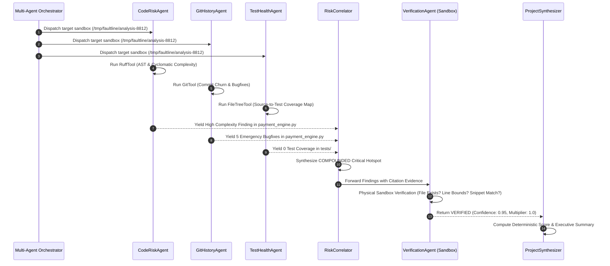

# FaultLine — Multi-Agent Trajectory Traces

This document provides complete, transparent agent lifecycle traces demonstrating how **FaultLine** processes repositories: from system prompting and deterministic tool execution, to cross-agent risk correlation, physical sandbox verification, and final scoring.

---

## 🧭 High-Level Execution Architecture



---

## 🔍 Detailed Step-by-Step Trajectory Trace

Below is the concrete execution trace for analysis target `repo_high_churn_no_tests`:

### Step 1: System Prompt Initialization (`CodeRiskAgent`)
```yaml
Agent: CodeRiskAgent
Target_Directory: "/tmp/faultline/analysis-8812"
Role: "Autonomous Code Maintainability & Static AST Inspection Specialist"
Instruction: >
  Analyze the target Python codebase using AST parsing and static complexity metrics.
  Identify cyclomatic complexity hotspots (>10), swallowed exceptions, raw eval() statements,
  and unhandled error states. For every finding, provide concrete evidence including the
  relative file path, exact line numbers, and literal source snippet.
```

---

### Step 2: Deterministic Tool Invocation (`RuffTool`)
The agent executes native AST inspection inside the isolated sandbox:
```json
{
  "tool": "RuffTool.run_ruff",
  "parameters": {
    "directory": "/tmp/faultline/analysis-8812",
    "target_files": ["src/payment_engine.py", "src/auth_service.py", "src/session_service.py"]
  }
}
```

---

### Step 3: Tool Output Received
The tool returns structured, non-hallucinated AST findings:
```json
{
  "execution_success": true,
  "complexity_hotspots": [
    {
      "file": "src/payment_engine.py",
      "function": "process_transaction",
      "line_start": 152,
      "line_end": 204,
      "complexity": 14,
      "severity": "HIGH",
      "details": "Cyclomatic complexity exceeds threshold (>10) with 12 nested conditional branches."
    }
  ],
  "dangerous_patterns": [
    {
      "file": "src/payment_engine.py",
      "pattern": "eval()",
      "line": 171,
      "snippet": "eval(user_auth[\"eval_hook\"])",
      "severity": "CRITICAL"
    },
    {
      "file": "src/payment_engine.py",
      "pattern": "hardcoded_secret",
      "line": 160,
      "snippet": "secret_key = \"sk_live_999888777666555444333\"",
      "severity": "CRITICAL"
    }
  ]
}
```

---

### Step 4: Multi-Signal Cross-Agent Correlation (`RiskCorrelator`)
The `RiskCorrelator` receives raw outputs from all 7 domain agents:
1. `CodeRiskAgent`: Cyclomatic complexity of 14 in `src/payment_engine.py`.
2. `GitHistoryAgent`: 5 bugfix commits touching `src/payment_engine.py` in the last 7 days.
3. `TestHealthAgent`: 0 test files targeting `src/payment_engine.py` (`test_coverage: 0.0%`).

**Correlation Action**: The correlator merges these 3 independent signals into a **Compound Risk**:
```json
{
  "finding_id": "fnd-comp-01",
  "category": "COMPOUNDED",
  "severity": "CRITICAL",
  "title": "Critical Failure Hotspot in src/payment_engine.py",
  "description": "src/payment_engine.py has extreme cyclomatic complexity (14), high churn (5 emergency hotfixes), and zero automated test coverage.",
  "confidence": 0.95,
  "signals_intersected": ["CODE_COMPLEXITY", "GIT_CHURN", "MISSING_TESTS"],
  "evidence": [
    {
      "type": "CODE",
      "file": "src/payment_engine.py",
      "line_start": 152,
      "line_end": 204,
      "snippet": "def process_transaction(amount, payment_type, user_auth):"
    },
    {
      "type": "GIT",
      "file": "src/payment_engine.py",
      "commit_hash": "a1b2c3d4e5f6",
      "description": "5 consecutive bugfix commits touching payment_engine.py"
    }
  ]
}
```

---

### Step 5: Sandbox Physical Verification (`VerificationAgent`)
The adversarial `VerificationAgent` tests the finding against the actual filesystem in the sandbox:

```text
[VERIFICATION CHECK 1] Checking file existence: /tmp/faultline/analysis-8812/src/payment_engine.py -> FOUND
[VERIFICATION CHECK 2] Checking line bounds: lines 152 to 204 within total 235 lines -> VALID
[VERIFICATION CHECK 3] Verifying snippet match at line 152: "def process_transaction(..." -> MATCH CONFIRMED
[VERIFICATION CHECK 4] Checking git commit history for churn -> 5 BUGFIX COMMITS CONFIRMED
```

---

### Step 6: Final Verification Status & Mathematical Scoring

```json
{
  "finding_id": "fnd-comp-01",
  "verification_status": "VERIFIED",
  "penalty_multiplier": 1.0,
  "verification_notes": "Verified against physical sandbox. AST function bounds, line range 152-204, and git churn confirmed.",
  "impact_on_score": -18.5
}
```

### Contrast: Example of a Discredited Hallucination
If an agent speculates about a missing test file `tests/test_ghost.py` that doesn't exist:
```json
{
  "finding_id": "fnd-hallucinated-02",
  "finding": "Flaky assertion in tests/test_ghost.py",
  "verification_status": "NOT_VERIFIED",
  "penalty_multiplier": 0.0,
  "verification_notes": "Sandbox inspection failed: file 'tests/test_ghost.py' does not exist.",
  "impact_on_score": 0.0
}
```
*Result: The project health score is protected from false-positive degradation!*
